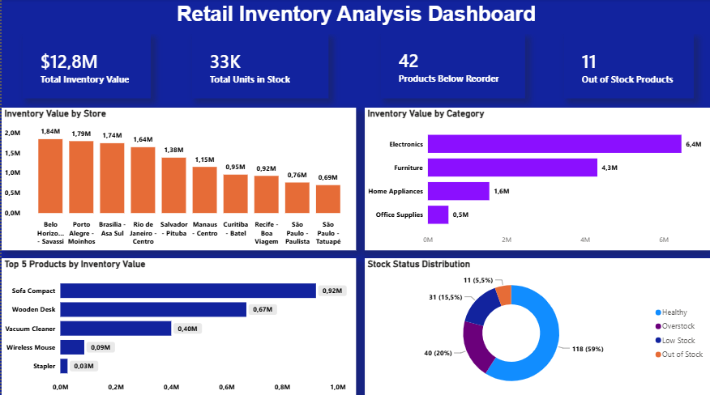

# 📦 Retail Inventory Analysis Dashboard

 
 
 


## 📌 Project Overview

The **Retail Inventory Analysis Dashboard** is a Business Intelligence project developed to simulate a real-world inventory management solution for retail operations.

This dashboard provides visibility into inventory levels, stock status, product performance, and inventory value across multiple stores, helping managers optimize replenishment decisions, reduce stockouts, and improve inventory efficiency.

---

## 🎯 Business Problem

Retail companies often struggle with:

- Excess inventory and overstock situations
- Stockouts that impact customer satisfaction
- Poor visibility into inventory distribution across stores
- Difficulty identifying high-value products
- Inefficient inventory replenishment processes

Without a centralized inventory monitoring system, decision-making becomes reactive rather than proactive.

---

## 💡 Business Solution

This dashboard consolidates inventory data into a single interactive report, enabling stakeholders to:

- Monitor inventory value across stores and categories
- Identify products below reorder levels
- Detect out-of-stock products
- Analyze inventory distribution by category
- Track inventory health status
- Prioritize inventory replenishment actions

---

## ❓ Business Questions

The dashboard was designed to answer the following questions:

- What is the total inventory value?
- How many units are currently in stock?
- Which products are below the reorder level?
- How many products are out of stock?
- Which categories represent the highest inventory value?
- Which stores hold the largest inventory value?
- What are the top-performing products by inventory value?
- What is the current inventory health status?

---

## 📊 Dashboard Overview

### Executive KPIs

- Total Inventory Value
- Total Units in Stock
- Products Below Reorder Level
- Out of Stock Products

### Inventory Analysis

- Inventory Value by Store
- Inventory Value by Category
- Top 5 Products by Inventory Value
- Stock Status Distribution

---

## 📈 Key Insights

- Electronics represent the largest share of inventory value.
- A significant number of products are operating below reorder levels.
- Inventory value is concentrated in a small group of high-value products.
- Most products are classified as Healthy, while a smaller percentage require replenishment or corrective action.
- Inventory distribution varies considerably across stores.

---

## 🛠️ Technologies Used

- Microsoft Power BI
- SQL
- DAX
- Microsoft Excel
- CSV Files
- Data Visualization
- GitHub

---

## 🗄️ SQL Analysis

The project includes a complete SQL analysis covering:

- Total Inventory Value
- Inventory Value by Category
- Inventory Value by Store
- Products Below Reorder Level
- Out of Stock Products
- Stock Status Distribution
- Inventory Value by Supplier
- Average Daily Sales by Category
- Inventory Turnover Analysis
- Top Products by Inventory Value
- Days of Supply Analysis
- Potential Revenue Analysis

---

## 📂 Repository Structure

```text
Retail-Inventory-Analysis-Dashboard
│
├── Data
│   └── retail_inventory.csv
│
├── SQL
│   └── inventory_analysis.sql
│
├── PowerBI
│   └── Retail_Inventory_Dashboard.pbix
│
├── Images
│   └── dashboard_preview.png
│
└── README.md
```

---

## 📸 Dashboard Preview



---

## 📊 Dashboard Highlights

| KPI | Value |
|------|------:|
| Total Inventory Value | $12.8M |
| Total Units in Stock | 33K |
| Products Below Reorder Level | 42 |
| Out of Stock Products | 11 |

---

## 🚀 What I Learned

Through this project, I strengthened my skills in:

- Inventory Analytics
- Retail Data Analysis
- SQL Query Development
- Business Intelligence
- KPI Design
- Data Modeling
- DAX Measures
- Dashboard Development in Power BI
- Data Storytelling

---

## 🔮 Future Improvements

Potential enhancements for future versions:

- Inventory Forecasting
- Demand Planning Analysis
- ABC Product Classification
- Supplier Performance Dashboard
- Inventory Trend Analysis
- Replenishment Optimization Model

---

## 👨🏾‍💻 Author

**Marcos Rogério da Silva**

Trade Marketing | Business Intelligence | Data Analytics

### Connect with me

- GitHub: https://github.com/marcosrdevbr
- LinkedIn: https://www.linkedin.com/in/marcos-rogerio-017923302/

Feel free to connect or share feedback about this project.

---

## ⭐ If you found this project interesting

If you enjoyed this project or found it useful, feel free to connect with me on LinkedIn or explore my other repositories on GitHub.

Thank you for visiting my portfolio!
